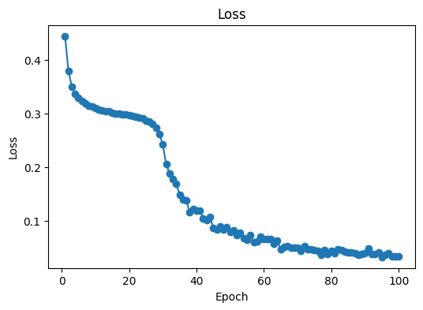
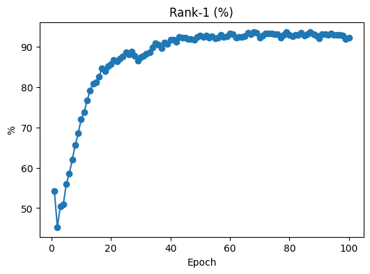
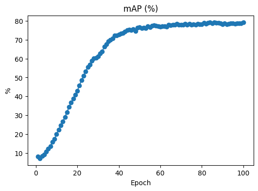
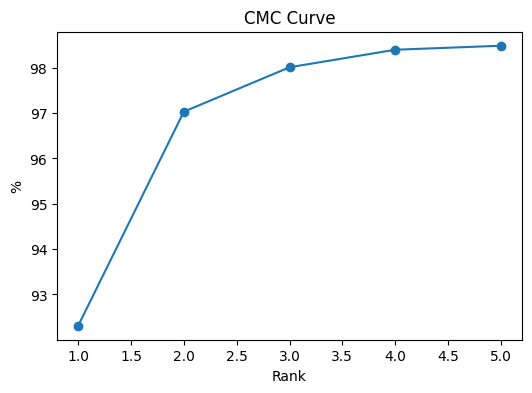
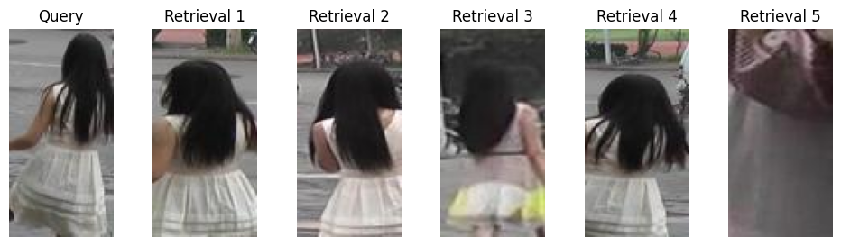
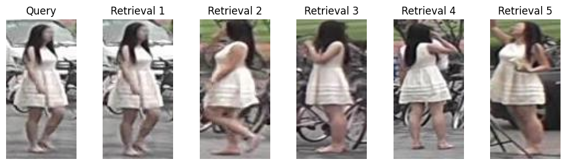
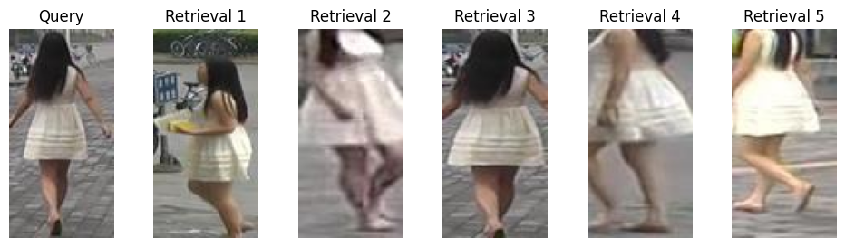
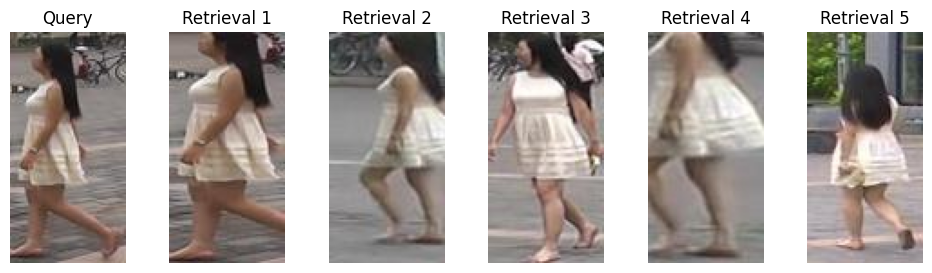

# Person Re-Identification Project

Simple, easy-to-understand implementation of a person re-identification system using PyTorch and Market-1501 dataset.

---

## 📌 Overview

This project trains a CNN-based model with triplet loss on Market-1501 to learn embeddings that match the same person across different camera views. At inference, it retrieves the top-5 most similar gallery images for each query.

---

## 🔧 Installation

1. **Clone the repository**  
   ```bash
   git clone https://github.com/zaanity/person-Re-id.git
   cd person-Re-id

2. **Create environment & install**
   ```bash
   conda create -n preid python=3.8 -y
   conda activate preid

---

## 🏗 Architecture

1. **Backbone**: ResNet-50 pretrained on ImageNet

2. **Embedding Head**: Linear layer projecting to 128-D, followed by L2 normalization

3. **Loss**: Batch-hard triplet loss (margin = 0.3)
    ```bash
    flowchart LR
    Input --> Preprocess
    Preprocess --> ResNet50
    ResNet50 --> EmbeddingLayer
    EmbeddingLayer --> L2Normalize
    L2Normalize --> Embeddings

## ⚙️ Usage

After training completes, evaluation is run automatically to produce retrieval examples and metrics.
    ```bash
    python train.py \
    --train_dir /path/to/Market-1501/bounding_box_train \
    --query_dir /path/to/Market-1501/query \
    --gallery_dir /path/to/Market-1501/bounding_box_test
---

## 📊 Training & Evaluation Results

1. **Loss Curve**


2. **Rank-1 Accuracy over Epochs**


3. **mAP over Epochs**


4. **CMC Curve (Top-5)**


5. **Final Metrics**

| Metric   | Value    |
|----------|---------:|
| Rank‑1   | 92.31%   |
| Rank‑5   | 98.49%   |
| Rank‑10  | 99.11%   |
| mAP      | 79.23%   |

---

## 🔍 Example Retrievals

Query & Top‑5 Results




